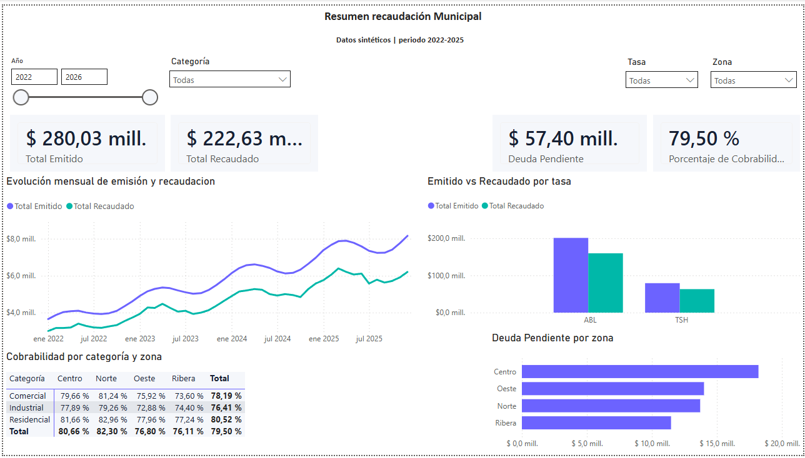
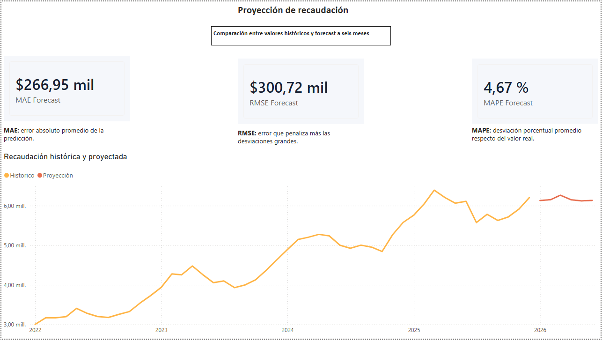

# Municipal Revenue Pipeline

Pipeline ETL y modelo de forecasting para analizar emisión, recaudación, deuda y
cobrabilidad municipal mediante datos completamente sintéticos.

> Este proyecto es demostrativo. No utiliza información, código ni credenciales de
> ninguna administración pública.

## Caso de negocio

Las áreas de gestión necesitan consolidar datos tributarios que suelen llegar desde
distintas fuentes, controlar su calidad y convertirlos en indicadores confiables.
Este proyecto automatiza ese recorrido y genera datasets listos para Power BI.

## Arquitectura

```text
Generador sintético
        |
        v
CSV de origen --> Validaciones de calidad --> Transformaciones
                                                |
                           +--------------------+-------------------+
                           |                                        |
                           v                                        v
                 Modelo dimensional                         Forecasting
                           |                                        |
                           v                                        v
                  SQLite/PostgreSQL                       Datasets Power BI
```

## Funcionalidades

- Generación reproducible de 43.000+ registros ficticios.
- Validación de nulos, importes inválidos y claves duplicadas.
- Separación de registros válidos y hallazgos de calidad.
- Cálculo de deuda, cobrabilidad y demora de pago.
- Modelo estrella con dimensiones de tasa, zona y categoría.
- Carga analítica en SQLite o PostgreSQL.
- Registro de ejecuciones del pipeline.
- Forecast de recaudación a seis meses con Random Forest.
- Evaluación con MAE, RMSE y MAPE.
- Exportaciones y medidas DAX preparadas para Power BI.

## Tecnologías

Python, Pandas, NumPy, SQLAlchemy, SQLite, PostgreSQL, scikit-learn, pytest,
Power BI y DAX.

## Ejecución rápida

```bash
python -m venv .venv

# Windows
.venv\Scripts\activate

pip install -r requirements.txt
python run_pipeline.py --regenerate
pytest
```

La ejecución predeterminada usa SQLite y no requiere instalar un servidor.

## PostgreSQL opcional

Con Docker instalado:

```bash
docker compose up -d
pip install psycopg[binary]
```

Definir la variable `DATABASE_URL` usando `.env.example` y volver a ejecutar el
pipeline.

## Salidas principales

```text
data/
├── municipal_revenue.db
├── raw/municipal_revenue_raw.csv
├── processed/power_bi_revenue_monthly.csv
├── processed/power_bi_revenue_forecast.csv
├── quality/quality_issues.csv
└── metrics/forecast_metrics.json
```

## Modelo de datos

- `fact_revenue`: hechos mensuales por cuenta tributaria.
- `dim_tax`: tipos de tasa.
- `dim_zone`: zonas ficticias.
- `dim_category`: categorías de contribuyente.
- `revenue_monthly`: agregado optimizado para visualización.
- `pipeline_runs`: trazabilidad de ejecuciones.

## Power BI

La guía de construcción, el tema visual y las medidas DAX se encuentran en
[`dashboard/`](dashboard/POWER_BI_GUIDE.md).

El dashboard propuesto contiene:

1. Resumen ejecutivo.
2. Análisis de cobrabilidad y deuda.
3. Comparación entre recaudación real y proyectada.

El archivo final puede descargarse desde
[`dashboard/municipal-revenue-dashboard.pbix`](dashboard/municipal-revenue-dashboard.pbix).

### Resumen ejecutivo



### Forecasting



### Demo

[Abrir el reporte compartido](https://mvl365-my.sharepoint.com/:u:/g/personal/ramiro_godino_vicentelopez_gov_ar/IQCIeo5ulbZ2R49SUsRtUbIDAQSZtD0KdRoecNbs1ALKuHo?e=AvExo2)


## Pruebas

```bash
pytest
```

Las pruebas verifican reglas de calidad y cálculos esenciales del modelo.

## Autor

**Ramiro Godino Soares Gache**  
Data Engineer  
[Portfolio](https://rsg-portfolio.vercel.app/) ·
[GitHub](https://github.com/ramisoaresgache)
